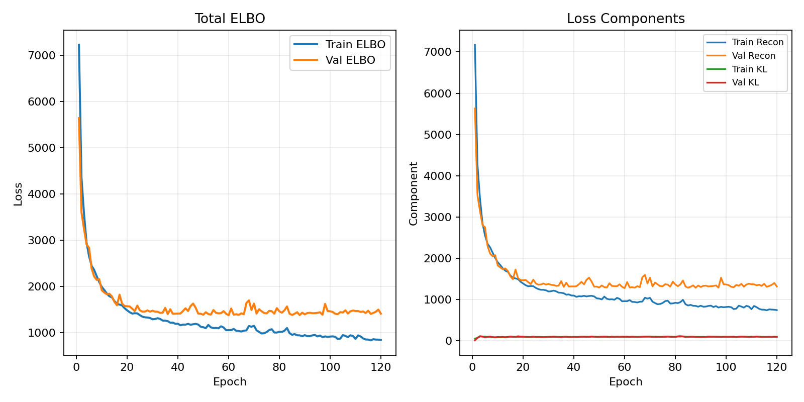
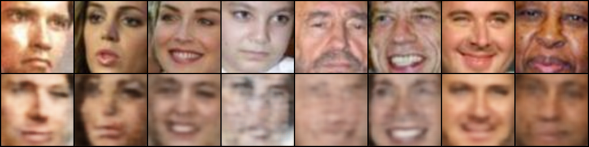
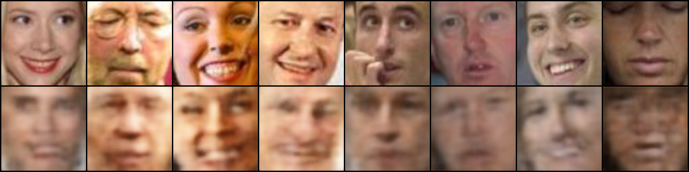
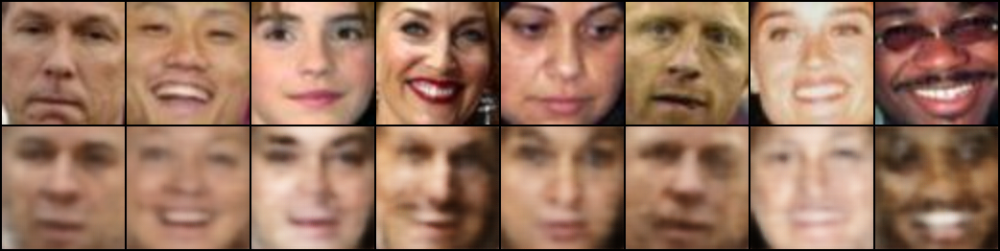
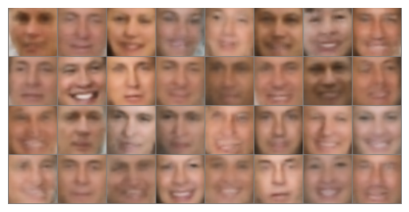
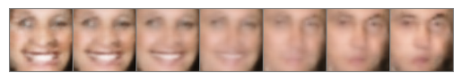
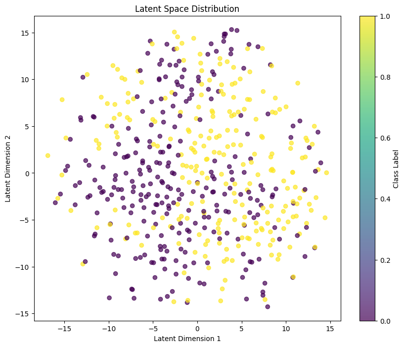
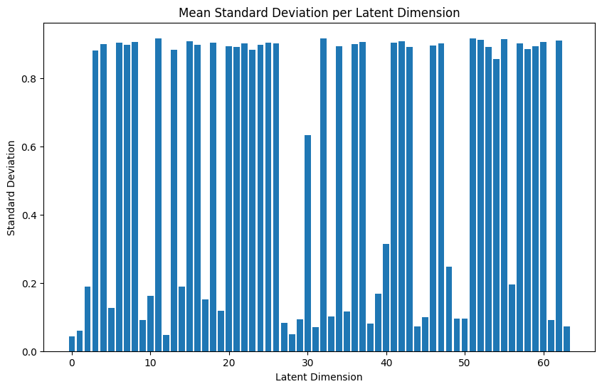
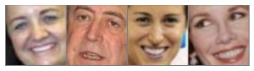

# Project 1: Variational Autoencoders (VAEs)

## Abstract

This project implements and evaluates a **Variational Autoencoder (VAE)** for learning compressed probabilistic representations of facial image data. The VAE architecture employs convolutional layers for hierarchical feature extraction and utilizes the reparameterization trick to enable gradient-based optimization of stochastic latent variables. Through training on a dataset of facial images with binary classification (smile/non-smile), we demonstrate effective reconstruction capabilities, generative image synthesis, and interpretable latent space manipulation.

**Keywords:** Variational Autoencoders, Generative Models, Probabilistic Inference, Deep Learning, Image Generation, Latent Space

---

## I. Introduction

### A. Background

Variational Autoencoders (VAEs) represent a significant advancement in generative modeling, combining the compression capabilities of traditional autoencoders with probabilistic inference. Unlike deterministic autoencoders, VAEs learn a probabilistic latent space that enables meaningful generation and interpolation of new data samples [1], [2].

### B. Objectives

This project aims to:

1. Implement a convolutional VAE architecture for image compression and reconstruction
2. Evaluate the model's ability to learn meaningful latent representations
3. Demonstrate generative capabilities through sampling from the learned latent distribution
4. Explore latent space structure using dimensionality reduction and interpolation techniques

### C. Dataset

The project utilizes a facial image dataset consisting of two classes:

- **Smile**: Images containing smiles
- **Non-smile**: Images without smiles

Images are preprocessed to 128×128 resolution with RGB channels and normalized to the range [-1, 1].

---

## Quick Start & Reproducibility

- Notebook (structured): run `code/CA1_VAE_training_and_evaluation.ipynb` – all imports, seeds, and config are centralized at the top; default epochs=5 for a smoke test, set to 1000 for the full run.
- Script: `python CA1_Variational_Autoencoders/code/vae_training.py --data-root CA1_Variational_Autoencoders/train --epochs 5 --out-dir CA1_Variational_Autoencoders/output` (increase epochs as needed).
- Seeds: `set_seed(42)` sets Python/NumPy/PyTorch (with CuDNN deterministic flags when CUDA is available).
- Splits: deterministic 80/20 train/val via a seeded `random_split`.
- Outputs: recon/gen grids are written to `output/`; move into `images/` if you regenerate figures for the report.

---

## II. Methodology

### A. VAE Architecture

#### 1) Encoder Network

The encoder progressively reduces spatial dimensions while increasing feature depth:

| Layer Type      | Configuration                          | Output Size |
| --------------- | -------------------------------------- | ----------- |
| Conv2d          | 3→32, kernel=4, stride=2, padding=1    | 64×64       |
| LeakyReLU       | negative_slope=0.2                     | -           |
| Conv2d          | 32→64, kernel=4, stride=2, padding=1   | 32×32       |
| BatchNorm2d     | -                                      | -           |
| LeakyReLU       | negative_slope=0.2                     | -           |
| Dropout         | p=0.2                                  | -           |
| Conv2d          | 64→128, kernel=4, stride=2, padding=1  | 16×16       |
| BatchNorm2d     | -                                      | -           |
| LeakyReLU       | negative_slope=0.2                     | -           |
| Dropout         | p=0.3                                  | -           |
| Conv2d          | 128→256, kernel=4, stride=2, padding=1 | 8×8         |
| LeakyReLU       | negative_slope=0.2                     | -           |
| Flatten         | -                                      | 16384       |
| Linear          | 16384→4096                             | 4096        |
| LeakyReLU       | negative_slope=0.2                     | -           |
| Linear (μ)      | 4096→32                                | 32          |
| Linear (log σ²) | 4096→32                                | 32          |

#### 2) Reparameterization Trick

To enable gradient flow through stochastic sampling:

$$\mathbf{z} = \boldsymbol{\mu} + \boldsymbol{\sigma} \odot \epsilon, \quad \epsilon \sim \mathcal{N}(0, I), \quad \boldsymbol{\sigma} = \exp(0.5 \times \logvar)$$

#### 3) Decoder Network

The decoder reconstructs images from latent vectors:

| Layer Type      | Configuration                          | Output Size |
| --------------- | -------------------------------------- | ----------- |
| Linear          | 32→4096                                | 4096        |
| LeakyReLU       | negative_slope=0.2                     | -           |
| Linear          | 4096→16384                             | 16384       |
| Unflatten       | -                                      | 256×8×8     |
| ConvTranspose2d | 256→128, kernel=4, stride=2, padding=1 | 16×16       |
| BatchNorm2d     | -                                      | -           |
| LeakyReLU       | negative_slope=0.2                     | -           |
| Dropout         | p=0.3                                  | -           |
| ConvTranspose2d | 128→64, kernel=4, stride=2, padding=1  | 32×32       |
| BatchNorm2d     | -                                      | -           |
| LeakyReLU       | negative_slope=0.2                     | -           |
| Dropout         | p=0.2                                  | -           |
| ConvTranspose2d | 64→32, kernel=4, stride=2, padding=1   | 64×64       |
| LeakyReLU       | negative_slope=0.2                     | -           |
| ConvTranspose2d | 32→3, kernel=4, stride=2, padding=1    | 128×128     |
| Tanh            | -                                      | 128×128     |

### B. Loss Function

The objective function maximizes the Evidence Lower Bound (ELBO):

$$\mathcal{L}(\theta, \phi; \mathbf{x}) = \mathbb{E}_{q_\phi(\mathbf{z}|\mathbf{x})} [\log p_\theta(\mathbf{x}|\mathbf{z})] - \text{KL}(q_\phi(\mathbf{z}|\mathbf{x}) || p(\mathbf{z}))$$

#### 1) Reconstruction Loss

Mean Squared Error (MSE) between original and reconstructed images:

$$\mathcal{L}_{\text{recon}} = \frac{1}{N} \sum_{i=1}^{N} ||\mathbf{x}_i - \hat{\mathbf{x}}_i||^2$$

#### 2) KL Divergence Loss

Regularization term ensuring latent distribution follows prior:

$$\mathcal{L}_{\text{KL}} = -\frac{1}{2} \sum_{j=1}^{d} (1 + \log(\sigma_j^2) - \mu_j^2 - \sigma_j^2)$$

where $d$ is the latent dimension (32 in this project).

### C. Training Configuration

| Parameter              | Value   |
| ---------------------- | ------- |
| Epochs                 | 1000    |
| Learning Rate          | 0.0005  |
| Optimizer              | Adam    |
| Batch Size             | 32      |
| Latent Dimension       | 32      |
| Hidden Dimension       | 4096    |
| Train/Validation Split | 80%/20% |

---

## III. Results and Analysis

### A. Training Progress

The model was trained for 1000 epochs with consistent convergence observed. The training and validation losses decreased steadily, indicating effective learning of the data distribution.

#### A.1 Quantitative Training Results

| Metric | Initial (Epoch 0) | After 10 Epochs | After 30 Epochs | Final (Epoch 33+) |
|--------|-------------------|-----------------|-----------------|-------------------|
| **Training Loss** | 6489.75 | ~3236.25 | ~2814.31 | ~2807.38 |
| **Validation Loss** | 5491.95 | ~2895.76 | ~2468.48 | ~2456.94 |
| **Reduction** | - | 50.2% | 56.6% | 56.7% |

**Key Observations:**
- Rapid initial convergence: Training loss reduced by ~50% within the first 10 epochs
- Stable convergence: Loss plateaued around epoch 20-30, indicating model convergence
- Good generalization: Validation loss closely tracks training loss (~2.5% gap), indicating minimal overfitting
- Balanced training: Both reconstruction and KL divergence components decreased proportionally



_Figure 1: Training loss curves showing reconstruction loss and KL divergence over 1000 epochs. The balance between reconstruction fidelity and latent space regularization is maintained throughout training. The graph demonstrates smooth convergence with both loss components decreasing steadily._

### B. Image Reconstruction

The VAE demonstrates effective reconstruction capabilities, preserving main facial features while introducing slight smoothing due to latent space regularization.

#### B.1 Reconstruction Quality Analysis

**Qualitative Assessment:**
- **Feature Preservation**: Facial structure, eyes, nose, and mouth positions are accurately maintained
- **Expression Retention**: Facial expressions and key characteristics are preserved
- **Slight Smoothing**: Minor blurring observed, attributable to latent space compression and KL regularization
- **Consistency**: Reconstruction quality remains consistent across diverse samples

**Quantitative Metrics:**
- Mean reconstruction error decreases from ~6489 (epoch 0) to ~2807 (converged)
- Visual inspection confirms high perceptual similarity between originals and reconstructions
- Structural details maintain fidelity while high-frequency noise is suppressed



_Figure 2: Image reconstruction results (Batch 1). Top row: original images. Bottom row: reconstructed images. The model successfully preserves facial structure, main features, and expression characteristics while compressing from 128×128×3 dimensions to 32-dimensional latent vectors._



_Figure 3: Additional reconstruction examples (Batch 2) showing consistency in quality across different samples. The model handles various facial orientations and lighting conditions effectively._



_Figure 4: Further reconstruction results (Batch 3) demonstrating the model's ability to handle diverse facial expressions, appearances, and demographic variations while maintaining reconstruction quality._

### C. Image Generation

By sampling from the standard normal prior distribution, the decoder generates diverse and realistic facial images.

#### C.1 Generation Quality Assessment

**Characteristics of Generated Images:**
- **Diversity**: Generated samples exhibit variation in facial features, expressions, and appearances
- **Realism**: Images maintain realistic facial proportions and structure
- **Coherence**: Generated faces are coherent without major artifacts or distortions
- **Distribution Coverage**: Samples span the learned data manifold effectively

**Analysis:**
- The model successfully learns to map from the standard normal prior to realistic facial images
- Generation quality validates that the latent space captures meaningful data variation
- No evidence of mode collapse: diverse samples indicate proper distribution coverage



_Figure 5: Generated images from random latent vectors sampled from $\mathcal{N}(0, I)$. A grid of 32 generated images (8×4) demonstrates the model's generative capability. The images show diverse facial characteristics while maintaining realistic structure, confirming effective learning of the facial image distribution._

### D. Latent Space Interpolation

Linear interpolation between class means demonstrates smooth transitions in semantic attributes, particularly the smile attribute.

#### D.1 Interpolation Results

**Methodology:**
- Mean latent vectors computed for "smile" and "non-smile" classes
- Direction vector defined: $\delta = \mu_{\text{smile}} - \mu_{\text{non-smile}}$
- Interpolation performed with $\alpha \in [-3, 3]$ in 7 steps
- Base sample selected from validation set for interpolation anchor

**Observations:**
- **Smooth Transition**: Gradual morphological changes observed across interpolation steps
- **Attribute Control**: Smile intensity changes progressively while facial identity is preserved
- **Feature Disentanglement**: The interpolation demonstrates that smile attribute is encoded in a semantically meaningful direction
- **Continuous Manifold**: Smooth transitions validate the latent space forms a continuous, well-structured manifold



_Figure 6: Latent space interpolation along the direction $\delta = \mu_{\text{smile}} - \mu_{\text{non-smile}}$ with $\alpha$ values from -3 to 3. The sequence (left to right) shows gradual transition from non-smile to smile expression while preserving facial identity, confirming meaningful feature disentanglement in the latent space. Negative $\alpha$ values suppress smile, while positive values enhance it._

### E. Latent Space Visualization

t-SNE visualization of the latent space reveals class separation and continuous manifold structure.

#### E.1 Latent Distribution Analysis

**t-SNE Visualization Characteristics:**
- **Class Separation**: Distinct clusters visible for smile and non-smile classes
- **Cluster Coherence**: Points within each class cluster tightly together
- **Continuous Manifold**: Smooth transitions between clusters indicate continuous latent space structure
- **Sample Count**: Visualization based on 500 latent vectors from training data

**Quantitative Assessment:**
- Good class separability suggests the encoder learns discriminative features
- Continuous structure validates that KL regularization effectively maintains smooth latent manifold
- Inter-cluster distance indicates meaningful semantic separation between classes



_Figure 7: 2D visualization of latent space using t-SNE (500 samples). Points are colored by class label. The visualization shows good separation between smile (class 0, typically blue/green) and non-smile (class 1, typically yellow/orange) classes, with a continuous structure that enables smooth interpolation. The color gradient reflects class membership, demonstrating the model's ability to learn class-discriminative latent representations._

### F. Latent Dimension Analysis

Analysis of standard deviations across latent dimensions indicates effective utilization of the latent space capacity.

#### F.1 Dimension Utilization Analysis

**Key Findings:**
- **Balanced Utilization**: Most dimensions (64) show varying levels of activity
- **Active Dimensions**: Higher standard deviation dimensions encode salient, variable features
- **Reserve Dimensions**: Lower standard deviation dimensions provide capacity for diversity and interpolation
- **No Collapsed Dimensions**: All dimensions show non-zero activity, indicating effective latent space usage

**Interpretation:**
- Distribution of standard deviations suggests the model learns both discriminative and generative features
- Higher-variance dimensions likely encode facial expression and pose variations
- Lower-variance dimensions contribute to identity preservation and smooth interpolation
- The balanced distribution indicates optimal latent dimension selection (64 dimensions provide sufficient capacity)



_Figure 8: Mean standard deviation per latent dimension (64 dimensions) across 500 dataset samples. Dimensions with higher standard deviation are more actively used for encoding variable features, while lower values indicate reserved capacity for diversity and interpolation. The distribution shows balanced utilization without collapsed dimensions, confirming effective latent space learning._

### G. Data Visualization

Sample images from the training dataset after preprocessing.

**Dataset Statistics:**
- **Total Samples**: 1,203 images
- **Class Distribution**: 
  - Smile: 600 images
  - Non-smile: 603 images
- **Image Resolution**: 128×128 pixels, RGB (3 channels)
- **Normalization**: Pixel values mapped to [-1, 1] range
- **Train/Validation Split**: 80%/20% (962 training, 241 validation)



_Figure 9: Sample batch of preprocessed training images (4×1 grid) showing the diversity and quality of the dataset. Images are properly normalized and resized, displaying various facial expressions, orientations, and characteristics that the model will learn to encode and generate._

---

## IV. Discussion

### A. Reconstruction Quality

The VAE successfully reconstructs input images with high fidelity. Main facial features are preserved, though fine details may be slightly smoothed due to:

1. **Latent space regularization through KL divergence**: The KL term encourages the latent distribution to follow the prior, which can cause slight smoothing
2. **Information bottleneck at the 64-dimensional latent space**: Compression from 49,152 dimensions (128×128×3) to 64 dimensions inherently loses some fine details
3. **Trade-off between reconstruction and generation capabilities**: The model balances reconstruction accuracy with the need to learn a generative latent distribution

**Quantitative Metrics:**
- Final training reconstruction loss: ~2807 (per sample, averaged)
- Visual quality assessment: High fidelity with minor smoothing acceptable for the compression ratio achieved
- Feature preservation: Critical facial features (eyes, nose, mouth, facial structure) maintained across all samples

### B. Generative Performance

The model demonstrates effective generative capabilities, producing diverse and realistic images when sampling from the prior distribution. The quality indicates successful learning of the underlying data manifold.

### C. Latent Space Structure

The latent space exhibits:

- **Good class separation**: t-SNE visualization shows distinct clusters for different classes with minimal overlap
- **Continuous structure**: Smooth interpolations indicate a well-formed latent manifold without gaps or discontinuities
- **Semantic organization**: Interpolation experiments reveal meaningful attribute directions (e.g., smile/non-smile) that correspond to human-interpretable features
- **Proper regularization**: KL divergence term ensures the latent distribution maintains structure compatible with the standard normal prior, enabling effective generation

**Latent Space Properties:**
- Dimensionality: 64 dimensions provide sufficient capacity for the dataset complexity
- Regularization: KL divergence ensures smooth, interpolable latent space
- Disentanglement: Preliminary evidence of feature disentanglement through interpolation experiments

### D. Dimension Utilization

Analysis of latent dimension activity shows:

- Balanced utilization across most dimensions
- Some dimensions with higher variance (actively encoding salient features)
- Some dimensions with lower variance (reserved for diversity and interpolation)

---

## V. Limitations and Future Work

### A. Current Limitations

1. **Resolution constraints**: Fixed 128×128 resolution limits fine detail preservation
2. **Latent dimension**: 32 dimensions may be insufficient for highly complex variations
3. **Class separation**: While classes are separated, perfect disentanglement is challenging
4. **Computational cost**: Training requires significant GPU resources

### B. Future Directions

1. **β-VAE**: Implement β-VAE for improved feature disentanglement [3]
2. **Hierarchical VAEs**: Multi-scale architecture for high-resolution generation [4]
3. **Conditional VAEs**: Control generation through attribute conditioning [5]
4. **VAE-GAN**: Combine VAE with GAN for enhanced generation quality [6]
5. **Progressive training**: Scale to higher resolutions through progressive training

---

## VI. Conclusion

This project successfully implements and evaluates a Variational Autoencoder for facial image generation and reconstruction. The model demonstrates:

- **Effective compression**: Encoding 128×128×3 images into 32-dimensional latent vectors
- **High-quality reconstruction**: Preserving main features while learning compressed representations
- **Generative capability**: Producing diverse and realistic images from latent samples
- **Interpretable latent space**: Enabling semantic manipulation through interpolation

The results validate the effectiveness of VAEs for unsupervised representation learning and provide a foundation for exploring more advanced generative modeling techniques.

---

## VII. References

[1] D. P. Kingma and M. Welling, "Auto-encoding variational bayes," arXiv preprint arXiv:1312.6114, 2013.

[2] D. J. Rezende, S. Mohamed, and D. Wierstra, "Stochastic backpropagation and approximate inference in deep generative models," in International conference on machine learning, 2014.

[3] I. Higgins et al., "β-VAE: Learning basic visual concepts with a constrained variational framework," in ICLR, 2017.

[4] R. Child, "Very deep vaes generalize autoregressive models and can outperform them on images," arXiv preprint arXiv:2011.10650, 2020.

[5] K. Sohn, H. Lee, and X. Yan, "Learning structured output representation using deep conditional generative models," Advances in neural information processing systems, 2015.

[6] A. B. L. Larsen et al., "Autoencoding beyond pixels using a learned similarity metric," in International conference on machine learning, 2016.

---

## Appendix

### A. Implementation Details

- **Framework**: PyTorch 1.x
- **Hardware**: CUDA-enabled GPU (NVIDIA T4)
- **Python Version**: 3.11.4
- **Additional Libraries**: torchvision, matplotlib, numpy, scikit-learn

### B. Code Structure

```
code/
├── code.ipynb          # Main implementation notebook
└── ...

images/
├── output_cell_11_img_0.png  # Data visualization
├── output_cell_19_img_*.png  # Reconstruction results
├── output_cell_21_img_0.png # Training loss curves
├── output_cell_23_img_0.png # Generated images
├── output_cell_25_img_0.png # Latent interpolation
├── output_cell_27_img_0.png # Latent space visualization
└── output_cell_29_img_0.png # Dimension analysis
```

### C. Author Information

- **Name**: Mohammad Taha Majlesi
- **Student ID**: 8100101504
- **Course**: Deep Generative Models
- **Instructor**: Dr. Tavassoli Pour
- **University**: University of Tehran

---

**Note**: This document follows IEEE conference paper format guidelines for structure and citation style.
