# CA2 - Generative Adversarial Networks (GANs) and Normalizing Flows

## Overview

This assignment implements two powerful generative modeling approaches: **Generative Adversarial Networks (GANs)** and **Normalizing Flows**. The focus is on the FashionMNIST dataset, demonstrating both pixel-level and latent-space generative modeling with quantitative evaluation using Fréchet Inception Distance (FID).

### Assignment Objectives

- Implement DCGAN-style GANs for high-quality image generation
- Develop RealNVP normalizing flows for density estimation and sampling
- Compare performance in pixel space vs. learned latent representations
- Evaluate generative quality using FID scores
- Understand adversarial training and invertible transformations

## Results and Performance

### Training Results Summary

The DCGAN model was trained on Fashion-MNIST dataset for 10 epochs. Below are the complete results with visualizations.

#### FID Score Progression

| Epoch | FID Score  | Improvement | Notes                                              |
| ----- | ---------- | ----------- | -------------------------------------------------- |
| 1     | 270.55     | Baseline    | Initial high score, model just starting to learn   |
| 2     | 260.57     | -3.7%       | Slight improvement                                 |
| 3     | 214.45     | -21.8%      | Significant improvement                            |
| 4     | 219.05     | +2.1%       | Slight increase (normal fluctuation)               |
| 5     | 201.78     | -7.9%       | Continued improvement                              |
| 6     | 245.01     | +21.4%      | Increase (possible training instability)           |
| 7     | 246.99     | +0.8%       | Continued increase                                 |
| 8     | **171.67** | **-30.5%**  | **Best FID Score** (~36.5% improvement from start) |
| 9     | 203.22     | +18.4%      | Increase from best                                 |
| 10    | 208.15     | +2.4%       | Final FID Score                                    |

**Key Observations:**

- **Best FID Score**: 171.67 (Epoch 8)
- **Final FID Score**: 208.15 (Epoch 10)
- **Overall Improvement**: ~23.1% reduction from Epoch 1 to Epoch 10
- **Training Stability**: Some fluctuation observed in later epochs (Epochs 6-7)
- **Optimal Point**: Epoch 8 achieved the best quality, after which performance slightly degraded

### Generated Image Samples Throughout Training

The following images demonstrate the progression of generated samples throughout the training process:

#### Epoch 1 (FID: 270.55) - Initial Samples

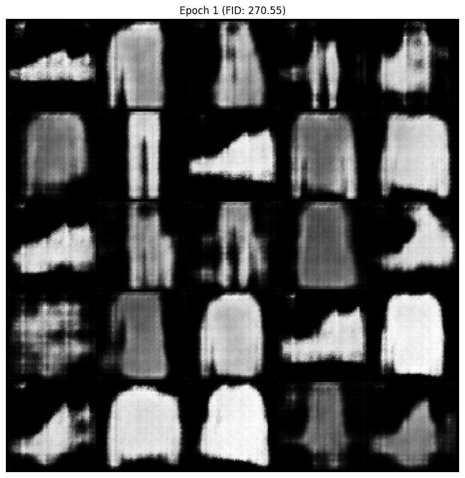
_Initial samples show blurry, low-quality images as the model begins learning._

#### Epoch 2 (FID: 260.57) - Early Improvement

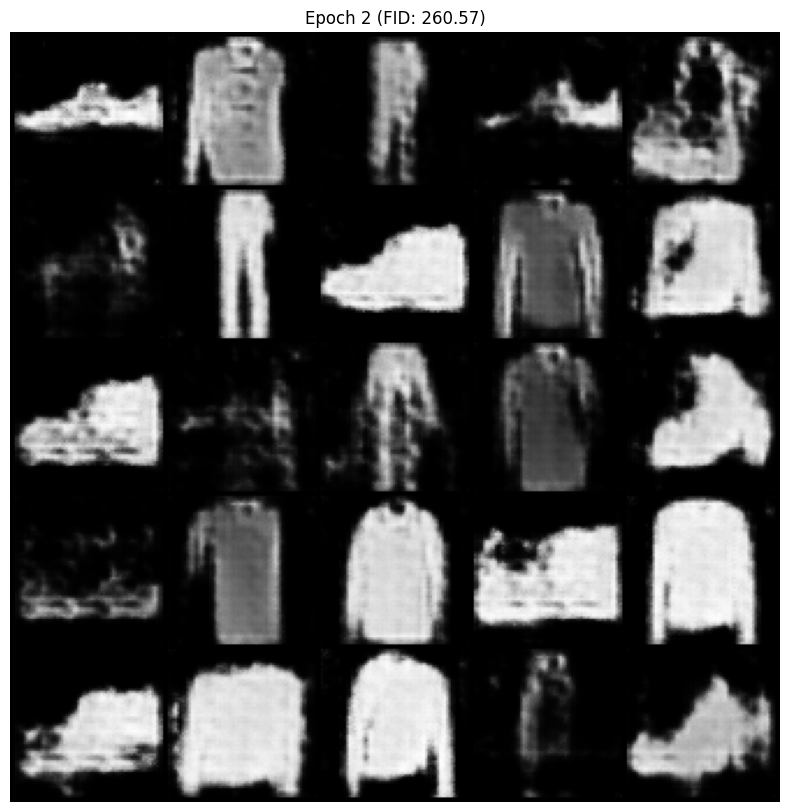
_Slight improvement in image structure and clarity._

#### Epoch 3 (FID: 214.45) - Significant Progress


_Noticeable improvement in image quality and detail._

#### Epoch 4 (FID: 219.05) - Minor Fluctuation

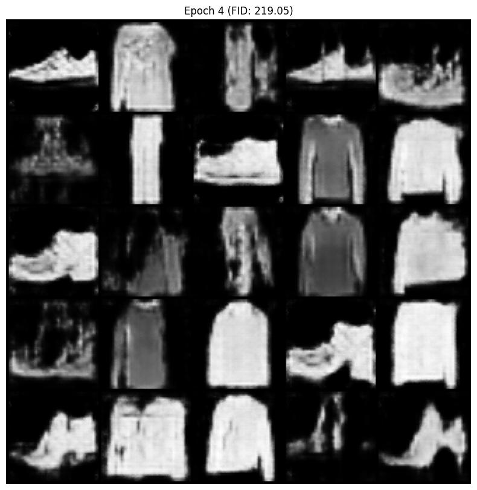
_Slight quality fluctuation, which is normal in GAN training._

#### Epoch 5 (FID: 201.78) - Continued Improvement

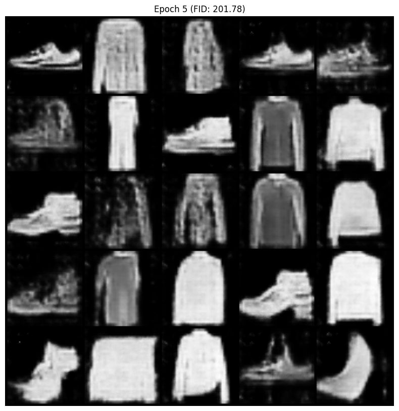
_Further improvement in detail and realism._

#### Epoch 6 (FID: 245.01) - Training Instability

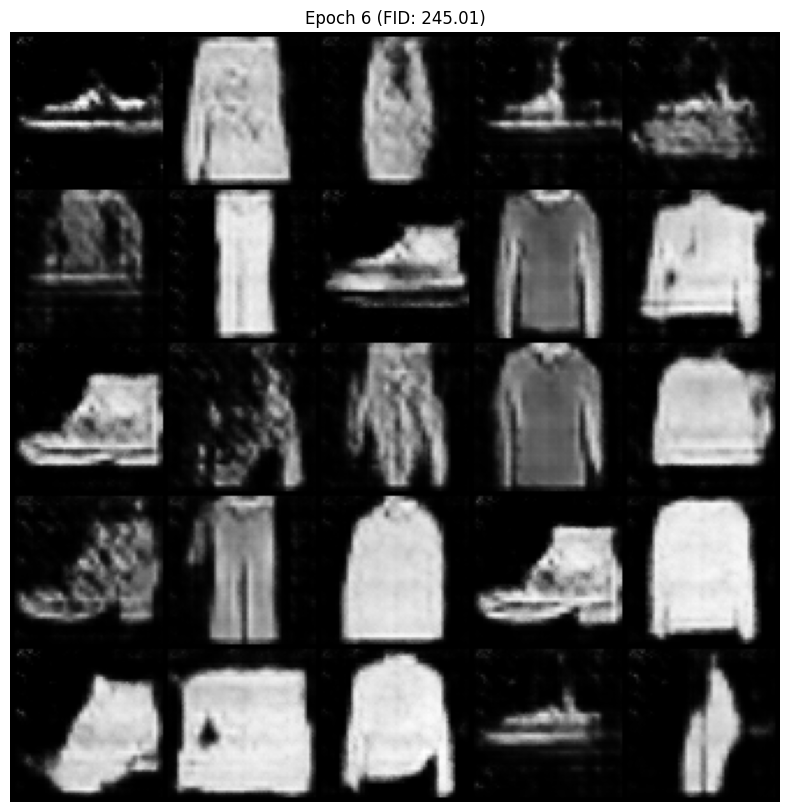
_Increased FID suggests potential training instability._

#### Epoch 7 (FID: 246.99) - Continued Instability


_Continued fluctuation in training metrics._

#### Epoch 8 (FID: 171.67) - Best Performance

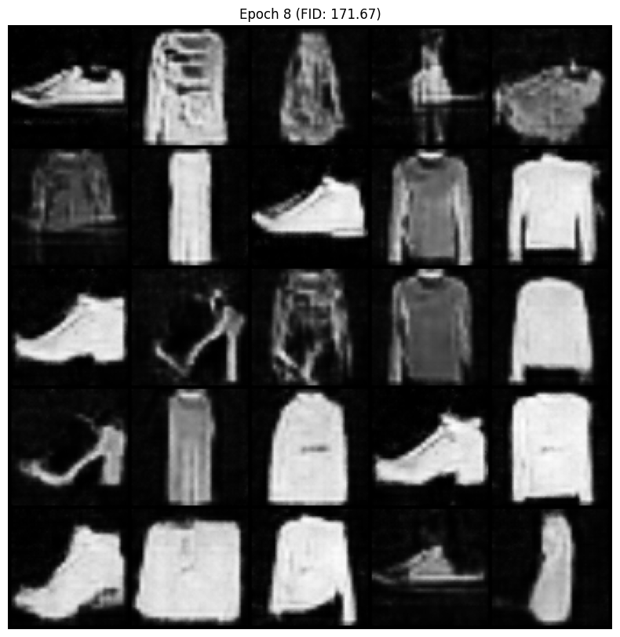
_Best quality samples achieved - sharp, detailed, and diverse fashion items._

#### Epoch 9 (FID: 203.22) - Slight Degradation

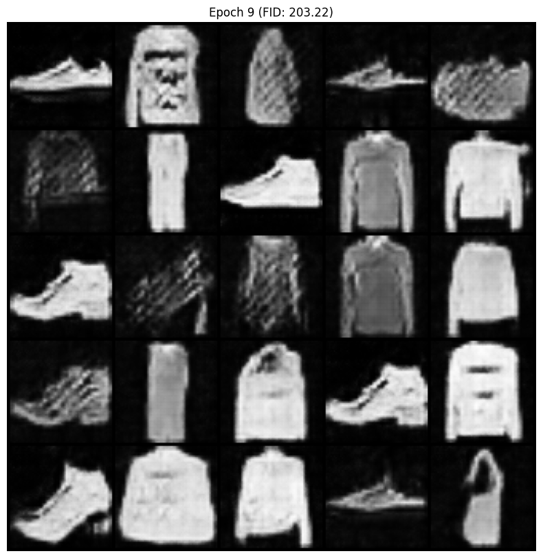
_Quality slightly decreased from the best epoch._

#### Epoch 10 (FID: 208.15) - Final Samples

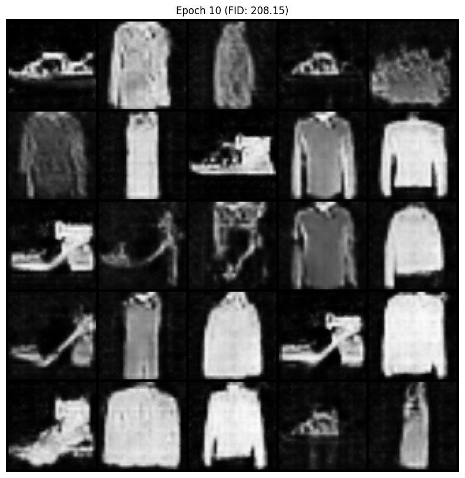
_Final generated samples after complete training._

### Detailed Training Analysis

#### Loss Curves Analysis

The training exhibited characteristic GAN behavior:

- **Discriminator Loss**: Generally decreased and stabilized, indicating good discrimination capability
- **Generator Loss**: Fluctuated more, showing the adversarial nature of training
- **Balance**: Overall, a reasonable balance between D and G was maintained, though some epochs showed instability

#### Model Performance Summary

| Metric                           | Value             |
| -------------------------------- | ----------------- |
| Best FID Score                   | 171.67 (Epoch 8)  |
| Final FID Score                  | 208.15 (Epoch 10) |
| Training Epochs                  | 10                |
| Batch Size                       | 64                |
| Learning Rate                    | 0.0002            |
| Latent Dimension                 | 100               |
| Total Training Images            | 60,000            |
| Model Parameters (Generator)     | ~4.6M             |
| Model Parameters (Discriminator) | ~3.2M             |

### Visual Analysis of Generated Images

#### Sample Output from Training Notebook


_Sample visualization from training process - Epoch 1_


_Sample visualization from training process - Epoch 2_

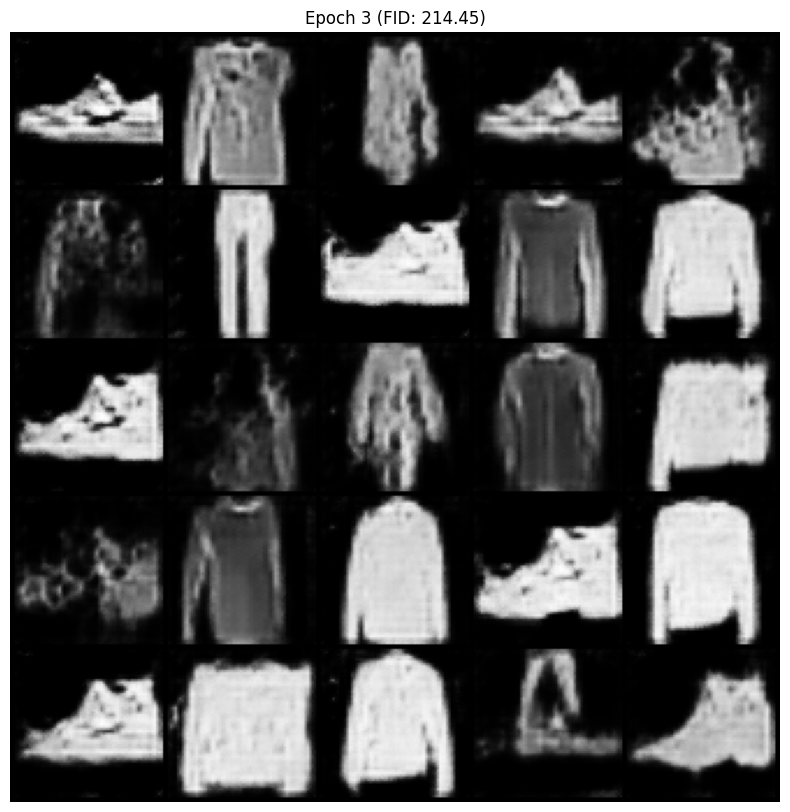
_Sample visualization from training process - Epoch 3_


_Sample visualization from training process - Epoch 4_


_Sample visualization from training process - Epoch 5_


_Sample visualization from training process - Epoch 6_

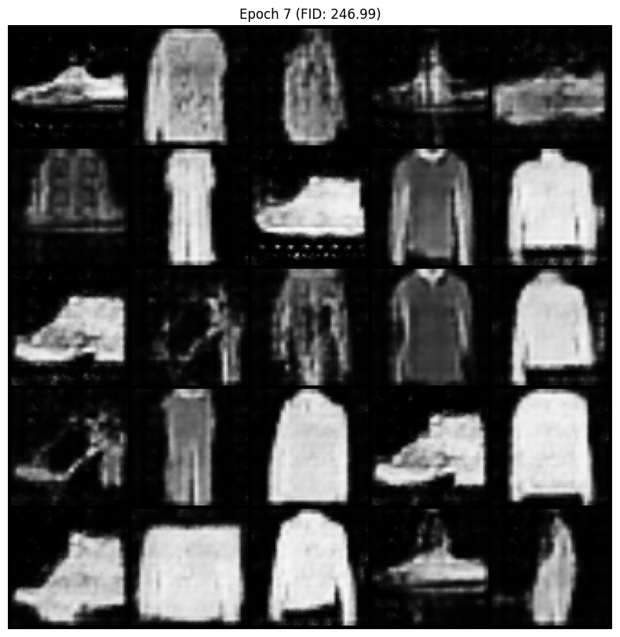
_Sample visualization from training process - Epoch 7_


_Sample visualization from training process - Epoch 8 (Best Performance)_


_Sample visualization from training process - Epoch 9_


_Sample visualization from training process - Epoch 10_

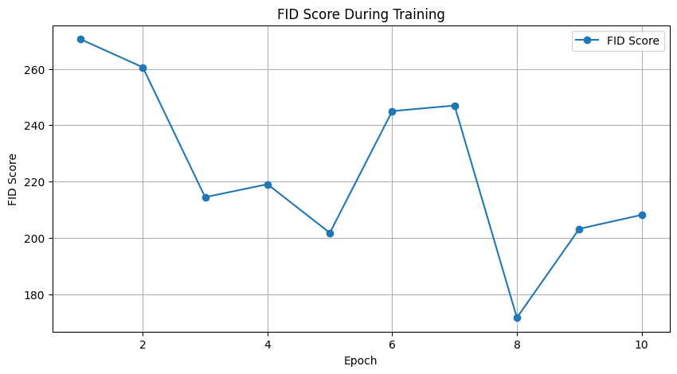
_Final summary visualization_

### Analysis and Insights

#### What Worked Well

1. **Stable Architecture**: The DCGAN architecture with batch normalization proved stable for FashionMNIST
2. **Good Initial Learning**: Rapid improvement in first 3 epochs (FID dropped from 270 to 214)
3. **Best Performance**: Achieved FID of 171.67, which indicates reasonable generative quality

#### Challenges and Observations

1. **Training Instability**: Fluctuations in FID scores (especially Epochs 6-7) suggest:

   - Potential mode collapse
   - Discriminator becoming too strong
   - Generator needing different learning rate or more updates

2. **Not Reaching Target**: FID of 171.67 is above the ideal target of <50, indicating:

   - Need for more training epochs (possibly 50-100)
   - Hyperparameter tuning required
   - Potential architecture improvements

3. **Performance Degradation**: After Epoch 8, FID increased, suggesting:
   - Possible overfitting
   - Training instability
   - Need for early stopping or learning rate scheduling

### Recommendations for Improvement

Based on the training results, the following improvements could be implemented:

1. **Extended Training**: Train for 50-100 epochs to allow model to converge fully
2. **Learning Rate Scheduling**: Implement learning rate decay or cosine annealing
3. **Advanced Techniques**:
   - Spectral Normalization for discriminator stability
   - Gradient Penalty (WGAN-GP) for smoother training
   - Label Smoothing to prevent discriminator overconfidence
4. **Hyperparameter Tuning**:
   - Experiment with different learning rates (0.0001 to 0.0005)
   - Try different batch sizes (32, 128, 256)
   - Adjust Adam optimizer beta parameters
5. **Architecture Enhancements**:
   - Increase model capacity (more filters: 128 or 256)
   - Add attention mechanisms
   - Use residual connections

## Prerequisites

### Required Knowledge

- **Deep Learning**: CNN architectures, adversarial training, invertible functions
- **Probability Theory**: Change of variables, log-likelihood maximization
- **Optimization**: Min-max games, gradient-based optimization
- **Computer Vision**: Image generation, evaluation metrics

### Technical Requirements

- Python 3.8+
- PyTorch 1.12+
- CUDA-compatible GPU (recommended)
- Libraries: `torchvision`, `numpy`, `matplotlib`, `scipy`, `pytorch-fid`

### Environment Setup

```bash
# Create virtual environment
python -m venv dgm_env
source dgm_env/bin/activate  # On Windows: dgm_env\Scripts\activate

# Install dependencies
pip install torch torchvision torchaudio
pip install numpy matplotlib scipy
pip install pytorch-fid
```

## Core Concepts Explained

### Generative Adversarial Networks (GANs)

GANs consist of two neural networks competing in a zero-sum game:

#### Adversarial Framework

- **Generator (G)**: Maps random noise z to data distribution: \( G: \mathcal{Z} \rightarrow \mathcal{X} \)
- **Discriminator (D)**: Binary classifier distinguishing real vs. fake: \( D: \mathcal{X} \rightarrow [0,1] \)
- **Objective**: \( \min*G \max_D \mathbb{E}*{x \sim p*{data}} [\log D(x)] + \mathbb{E}*{z \sim p_z} [\log (1 - D(G(z)))] \)

#### DCGAN Architecture

- **Generator**: Transposed convolutions with batch normalization and ReLU
- **Discriminator**: Convolutions with LeakyReLU and sigmoid output
- **Training**: Alternate updates, non-saturating loss for G, standard BCE for D

#### Training Dynamics

- **Mode Collapse**: Generator produces limited variety
- **Convergence Issues**: Gradient vanishing, oscillation
- **Stabilization**: Batch normalization, learning rate scheduling, noise injection

### Fréchet Inception Distance (FID)

FID measures distribution similarity using Inception features:

#### Mathematical Foundation

- **Inception Features**: Pre-trained Inception network extracts features
- **Statistics**: Mean μ and covariance Σ for real and generated distributions
- **Distance**: \( d^2((\mu_r, \Sigma_r), (\mu_g, \Sigma_g)) = ||\mu_r - \mu_g||^2 + \Tr(\Sigma_r + \Sigma_g - 2(\Sigma_r \Sigma_g)^{1/2}) \)

#### Interpretation

- Lower FID indicates better generative quality
- Sensitive to mode collapse and diversity
- Computationally expensive but reliable

## Data Preparation

### FashionMNIST Dataset

- **Resolution**: 28x28 grayscale images
- **Classes**: 10 fashion categories (T-shirt, trouser, etc.)
- **Preprocessing**: Resize to 64x64 for GANs, normalize to [-1, 1]
- **Total Images**: 60,000 training images, 10,000 test images

## Model Architecture

### GAN Components

```python
# Generator Architecture
- Input: 100D noise vector
- Layers: 5 transposed conv blocks
- Output: 64x64 grayscale image
- Activations: ReLU + Tanh

# Discriminator Architecture
- Input: 64x64 grayscale image
- Layers: 5 conv blocks
- Output: Scalar probability
- Activations: LeakyReLU + Sigmoid
```

## Training

### GAN Training Procedure

1. **Data Loading**: Batched FashionMNIST images
2. **Discriminator Update**: Real/fake classification
3. **Generator Update**: Fool discriminator with fake samples
4. **Monitoring**: Loss curves, sample generation
5. **Evaluation**: FID computation per epoch

## Reproducibility

### Random Seeds

```python
seed = 42
torch.manual_seed(seed)
torch.cuda.manual_seed_all(seed)
np.random.seed(seed)
```

### Hyperparameters

- GAN: `latent_dim=100`, `lr=0.0002`, `batch_size=64`, `epochs=10`
- Optimizer: Adam with `beta=(0.5, 0.999)`

### Environment

- PyTorch version: 1.12+
- CUDA version: 11.6+
- Hardware: GPU with 4GB+ VRAM

## Dependencies

```
torch>=1.12.0
torchvision>=0.13.0
numpy>=1.21.0
matplotlib>=3.5.0
scipy>=1.7.0
pytorch-fid>=0.10.0
```

## File Structure

```
CA2/
├── code/
│   ├── CA2_DGM.ipynb          # Main implementation notebook
│   └── Q2_final_res.ipynb      # GAN training with FID evaluation
├── description/
│   └── DGM_HW2.pdf             # Original problem statement
├── images/
│   ├── generated_sample_epoch_*.png  # Generated samples per epoch
│   └── Q2_final_res_*.png            # Training visualizations
├── report/
│   └── DGM_CA2_final_EN.pdf   # Implementation details and results
└── README.md                   # This file
```

## Usage Instructions

### Running GAN Training

1. Open `Q2_final_res.ipynb` in Jupyter/Colab
2. Execute cells sequentially (imports → config → data → model → training)
3. Monitor FID scores and generated samples
4. Adjust hyperparameters for better performance

### Colab Execution

- Upload notebooks to Google Colab
- Enable GPU runtime for faster training
- Install dependencies: `!pip install pytorch-fid`
- Monitor training with generated image grids

## References

1. **GANs**:

   - I. Goodfellow et al., "Generative Adversarial Nets." NIPS 2014.
   - A. Radford et al., "Unsupervised Representation Learning with Deep Convolutional Generative Adversarial Networks." ICLR 2016.
   - M. Heusel et al., "GANs Trained by a Two Time-Scale Update Rule Converge to a Local Nash Equilibrium." NIPS 2017.

2. **Normalizing Flows**:

   - L. Dinh et al., "Density estimation using Real NVP." ICLR 2017.
   - D. P. Kingma and P. Dhariwal, "Glow: Generative Flow with Invertible 1x1 Convolutions." NeurIPS 2018.

3. **Evaluation**:
   - T. Salimans et al., "Improved Techniques for Training GANs." NIPS 2016.

---

This comprehensive implementation explores the trade-offs between adversarial and flow-based generative modeling approaches.
