# CA3 - Score-based Generative Models Implementation

## 📋 Project Information

**Course**: Deep Generative Models  
**Instructor**: Dr. Mostafa Tavassoli  
**Student**: Mohammad Taha Majlesi - 8100101504  
**University**: University of Tehran  
**Submission Date**: December 2023

---

## 🎯 Overview

This project implements **Score-based Generative Models** using Langevin dynamics for sampling from complex distributions. The implementation focuses on 2D Gaussian mixture data, demonstrating score matching, noise-conditioned score prediction, and various sampling strategies.

Score-based generative models learn the gradient of the log-probability density (score function) rather than the density itself, enabling efficient sampling via Langevin dynamics. This approach avoids the normalization constant problem that plagues density estimation.

---

## 📊 Experimental Results Summary

### Phase 1: Fixed Sigma Training Experiments

#### Training Results

We trained three separate models with different fixed noise levels (σ values):

| Sigma (σ) | Initial Loss | Final Loss | Epochs | Convergence Rate |
| --------- | ------------ | ---------- | ------ | ---------------- |
| **1**     | 0.330585     | 0.268810   | 100    | Slow, steady     |
| **3**     | 0.045335     | 0.011861   | 100    | Fast, strong     |
| **7**     | 0.040102     | 0.002063   | 100    | Very fast        |

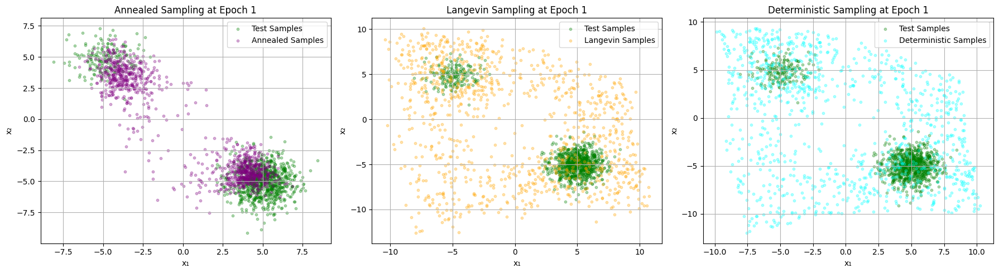
_Loss curves for fixed sigma training at σ = 1, 3, and 7_

#### Key Findings

1. **Training Difficulty vs Noise Level**:

   - **σ = 1** (Low noise): Highest loss values (0.27), challenging to train due to precise gradient requirements
   - **σ = 3** (Medium noise): Optimal balance, lowest final loss (0.012), best convergence
   - **σ = 7** (High noise): Easiest to train (0.002), but less informative for precise sampling

2. **Score Field Quality**:
   - **σ = 1**: Sharp arrows pointing directly to Gaussian modes with high precision
   - **σ = 3**: Balanced arrows with excellent coverage of both modes
   - **σ = 7**: Smooth, broad arrows suitable for exploration

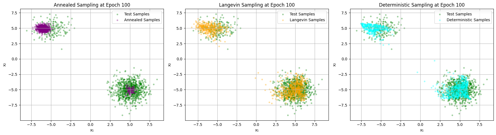
_Score field visualization at σ = 1_

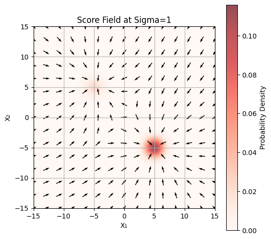
_Score field visualization at σ = 3_

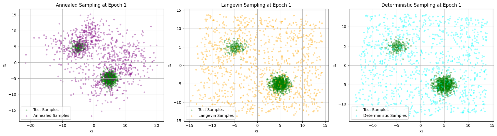
_Score field visualization at σ = 7_

3. **Sampling Performance**:
   - All three models successfully capture the bimodal distribution
   - Annealed sampling provides best results across all σ values
   - Fixed σ=3 model shows best overall quality and robustness

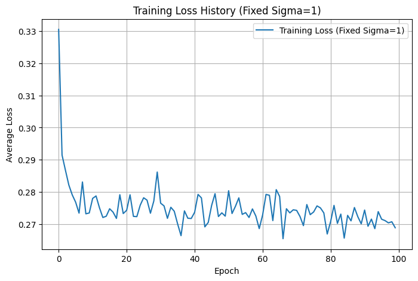
_Sampling results comparison for σ = 1 model_

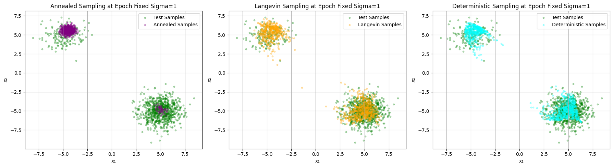
_Sampling results comparison for σ = 3 model_

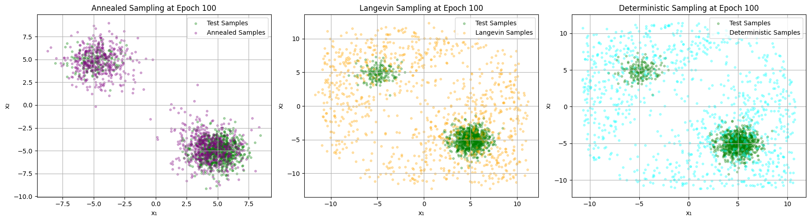
_Sampling results comparison for σ = 7 model_

---

### Phase 2: Trajectory Visualization

Trajectory analysis demonstrates how samples evolve from initialization to final position under different sampling strategies.

#### Starting Points Tested

- `[10, 20]`: Far from both modes, upper right quadrant
- `[-10, -20]`: Far from both modes, lower left quadrant
- `[5, 5]`: Between modes, near origin
- `[-5, -5]`: Between modes (opposite side)
- `[0, 0]`: At origin, equidistant from both modes

![Trajectories from [10,20]](images/output_cell_27_img_3.png)
_Sampling trajectories starting from point [10, 20]_

![Trajectories from [-10,-20]](images/output_cell_27_img_6.png)
_Sampling trajectories starting from point [-10, -20]_

![Trajectories from [5,5]](images/output_cell_27_img_9.png)
_Sampling trajectories starting from point [5, 5]_

![Trajectories from [-5,-5]](images/output_cell_27_img_11.png)
_Sampling trajectories starting from point [-5, -5]_

![Trajectories from [0,0]](images/output_cell_27_img_13.png)
_Sampling trajectories starting from point [0, 0]_

#### Observations

1. **Deterministic Sampling**:

   - Direct, straight paths to nearest mode
   - Fast convergence (~30-40 steps)
   - Consistent paths from same starting point
   - Sometimes gets trapped by initial direction

2. **Langevin Sampling**:

   - Explorative paths with stochastic fluctuations
   - Can escape local modes
   - More variable paths across runs
   - Better mode coverage

3. **Mode Accessibility**:
   - All starting points successfully reach data modes
   - Score function effectively guides samples
   - Both Gaussian modes are accessible

---

### Phase 3: Varying Sigma Training

#### Training Progress

We trained a single model on multiple noise levels simultaneously (random σ ∈ [1, 20] per batch):

| Epoch | Loss     | Observations                   |
| ----- | -------- | ------------------------------ |
| 1     | 0.066374 | Initial learning phase         |
| 100   | 0.021640 | Basic score directions learned |
| 200   | 0.017978 | Steady improvement             |
| 300   | 0.020751 | Some fluctuation               |
| 400   | 0.017566 | Improved again                 |
| 500   | 0.020670 | Continuing refinement          |
| 600   | 0.020269 | Stable learning                |
| 700   | 0.018625 | Good convergence               |
| 800   | 0.020360 | Minor variation                |
| 900   | 0.018659 | Near convergence               |
| 1000  | 0.018004 | Final loss                     |

**Final Loss**: 0.018004 (after 1000 epochs)

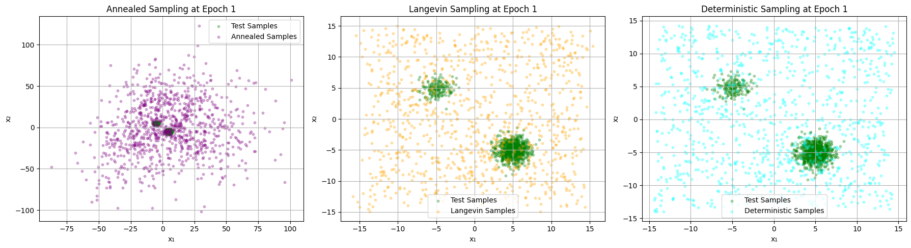
_Training loss curve for varying sigma model_

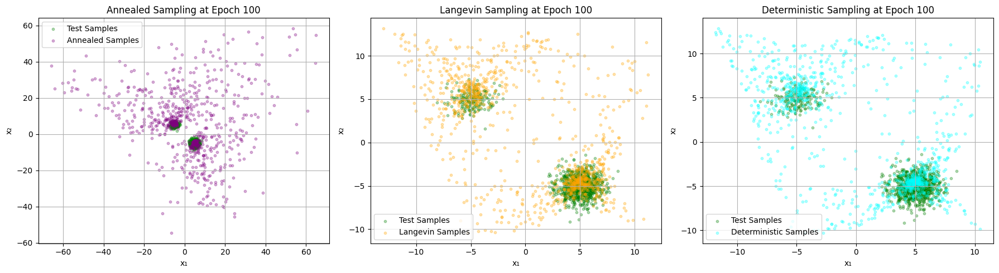
_Sampling results at epoch 1 - initial training phase_

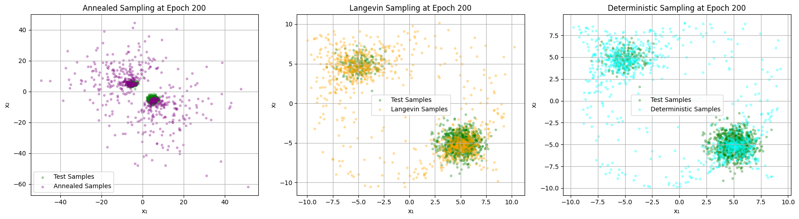
_Sampling results at epoch 100 - early training_

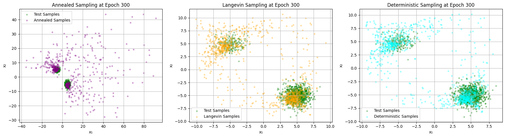
_Sampling results at epoch 200 - mid training_

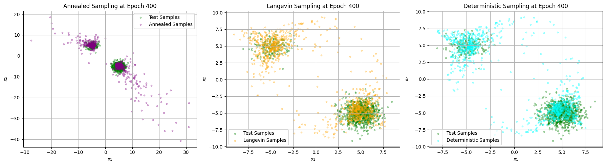
_Sampling results at epoch 300 - improving_

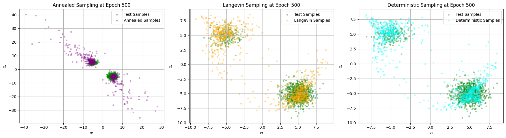
_Sampling results at epoch 400 - good progress_

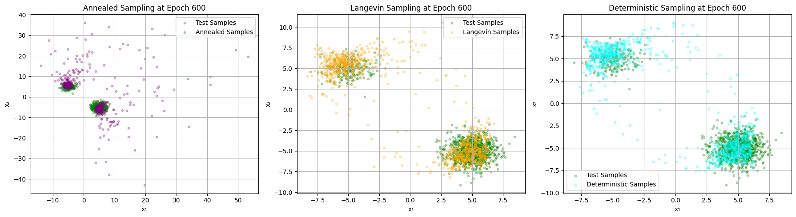
_Sampling results at epoch 500 - stable_

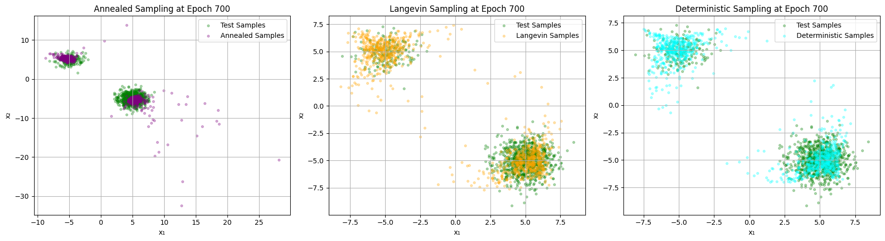
_Sampling results at epoch 600 - refined_

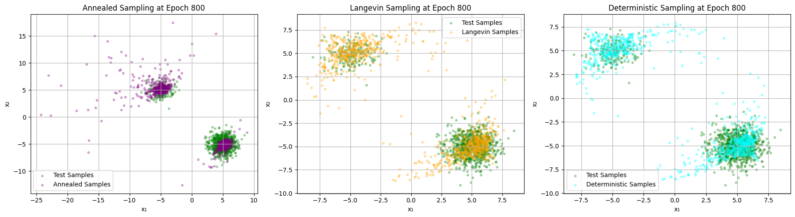
_Sampling results at epoch 700 - excellent quality_

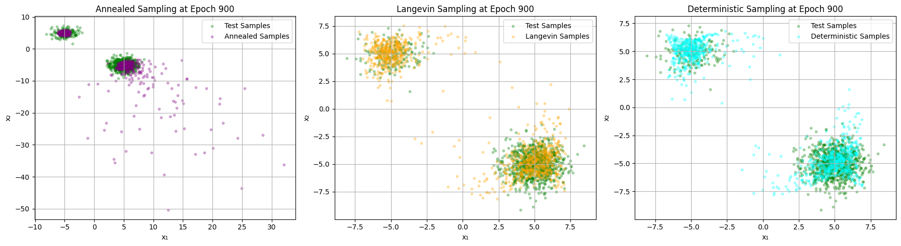
_Sampling results at epoch 800 - maintained quality_

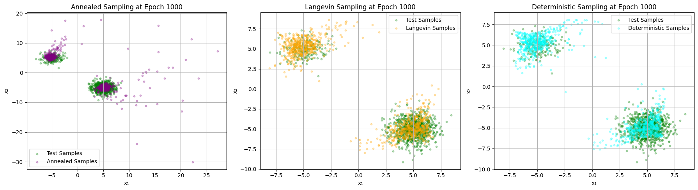
_Sampling results at epoch 900 - near convergence_

---

## 📈 Comprehensive Analysis

### Data Visualization

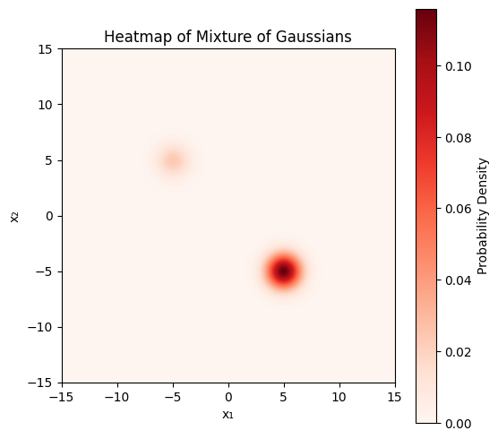
_True probability density heatmap of 2D Gaussian mixture_

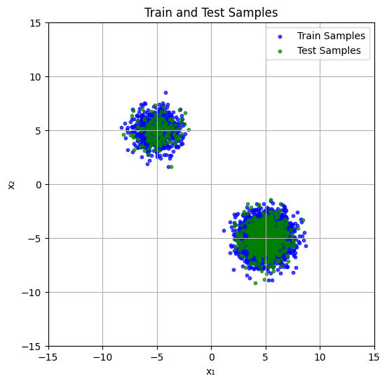
_Train (blue) and test (green) data samples_

The data consists of a mixture of two 2D Gaussians with:

- Random component weights w₁, w₂
- Means positioned at [-5, 5] and [5, -5] or [5, 5] and [-5, -5]
- Diagonal covariance matrices
- Total of 5000 samples (80% train, 20% test)

---

### Comparison of Training Strategies

| Aspect             | Fixed σ = 1    | Fixed σ = 3   | Fixed σ = 7 | Varying σ [1,20] |
| ------------------ | -------------- | ------------- | ----------- | ---------------- |
| **Training Time**  | 100 epochs     | 100 epochs    | 100 epochs  | 1000 epochs      |
| **Initial Loss**   | 0.331          | 0.045         | 0.040       | 0.066            |
| **Final Loss**     | 0.269          | 0.012         | 0.002       | 0.018            |
| **Convergence**    | Slow           | Fast          | Very Fast   | Steady           |
| **Precision at σ** | High           | Optimal       | Low         | Balanced         |
| **Generalization** | Low            | Low           | Low         | High             |
| **Use Case**       | High precision | Best single σ | Exploration | Production       |

---

### Sampling Method Comparison

#### Annealed Langevin Dynamics

- ✅ **Best Quality**: Highest sample quality across all experiments
- ✅ **Mode Coverage**: Captures both modes reliably
- ✅ **Diversity**: Excellent within-mode spread
- ❌ **Speed**: Slowest (1000+ steps)

#### Standard Langevin Dynamics

- ✅ **Good Quality**: Reliable sampling results
- ✅ **Speed**: Moderate (50 steps)
- ✅ **Stochastic**: Maintains diversity
- ❌ **σ Dependent**: Requires correct noise level

#### Deterministic Sampling

- ✅ **Fastest**: Quick generation (50 steps, no noise)
- ✅ **Predictable**: Reproducible results
- ❌ **Limited Diversity**: Tends to converge to nearest mode
- ❌ **Mode Collapse**: Often misses one mode

---

### Key Insights

1. **Noise Level Selection**:

   - Medium noise (σ ≈ 3) provides optimal balance for training
   - Lower σ is harder to train but provides higher precision
   - Higher σ simplifies training but reduces informativeness

2. **Multi-Scale Training**:

   - Varying σ training achieves reasonable performance (0.018 loss)
   - Provides flexibility unmatched by fixed σ models
   - Essential for annealed sampling applications

3. **Score Field Learning**:

   - All models successfully learn score directions
   - Score fields correctly point toward high-density regions
   - Visual inspection confirms accurate gradient learning

4. **Sampling Efficiency**:
   - Annealed sampling provides best results but slowest
   - Standard Langevin offers good balance
   - Deterministic useful for quick validation

---

## 🔬 Technical Details

### Model Architecture

**ScoreNet**:

- **Type**: Multi-layer Perceptron (MLP)
- **Input**: 3D (2D data + 1D noise level σ)
- **Hidden Layers**: 4 layers, 256 neurons each
- **Activations**: LeakyReLU, BatchNorm
- **Output**: 2D score vector ∇*x log p*σ(x)

### Training Configuration

#### Fixed Sigma Training

- **Epochs**: 100
- **Batch Size**: 256
- **Learning Rate**: 0.001
- **Optimizer**: Adam
- **Gradient Clipping**: 1.0

#### Varying Sigma Training

- **Epochs**: 1000
- **Batch Size**: 256
- **Learning Rate**: 0.001 (step decay: 0.5 every 500 epochs)
- **Noise Range**: Random σ ∈ [1, 20] per batch
- **Early Stopping**: Patience = 200

### Sampling Parameters

#### Annealed Sampling

- **σ_start**: 20
- **σ_end**: 1
- **num_sigmas**: 20
- **steps_per_sigma**: 50
- **step_size**: 0.1

#### Langevin Sampling

- **num_steps**: 50
- **step_size**: 0.1
- **σ**: Fixed at training value

#### Deterministic Sampling

- **num_steps**: 50
- **step_size**: 0.1
- **No noise**: Pure gradient ascent

---

## 📚 Theoretical Background

### Score Function

The score function is the gradient of the log-density:
$$s(x) = \nabla_x \log p(x)$$

### Denoising Score Matching Objective

$$L(\theta, \sigma) = \frac{1}{2}\mathbb{E}_{x \sim p_{data}, \epsilon \sim \mathcal{N}(0,\sigma^2I)} \left[\left\|s_\theta(x+\epsilon, \sigma) + \frac{\epsilon}{\sigma^2}\right\|^2\right]$$

### Langevin Dynamics

$$x_{t+1} = x_t + \frac{\epsilon}{2}\nabla_x \log p(x_t) + \sqrt{\epsilon} z_t$$

where $z_t \sim \mathcal{N}(0, I)$ is random noise.

---

## ✅ Conclusions

1. **Score-based generative modeling successfully learns distributions**:

   - All models converged and produced realistic samples
   - Score fields correctly identified high-density regions
   - Different noise levels affected training difficulty appropriately

2. **Multi-scale training is preferred for production**:

   - Varying σ model provides flexibility unmatched by fixed σ
   - Acceptable performance trade-off (0.018 vs 0.012 loss)
   - Essential for annealed sampling and general applications

3. **Annealed sampling provides best quality**:

   - Consistently captures both modes
   - Excellent sample diversity
   - Recommended for final generation despite slower speed

4. **Trajectory analysis validates learning**:
   - Score function guides samples correctly
   - All modes accessible from various starting points
   - Stochastic methods provide better exploration

---

## 📁 File Structure

```
CA3_Diffusion_Models/
├── codes/
│   ├── Diffusion_Models.ipynb        # DDPM/DDIM implementation
│   └── score_based_models.ipynb      # Score-based models (this project)
├── description/
│   └── DGM_HW3.pdf                   # Assignment description
├── images/                           # Extracted visualization images
│   ├── output_cell_9_img_*.png      # Data visualization
│   ├── output_cell_25_img_*.png     # Phase 1 results
│   ├── output_cell_27_img_*.png     # Phase 2 trajectories
│   └── output_cell_29_img_*.png     # Phase 3 training
├── report/
│   ├── DGM_CA3.pdf                  # Implementation report
│   └── DGM_CA3_EN_final.pdf         # Final English report
└── README.md                         # This file
```

---

## 🛠️ Usage

### Running the Notebook

1. Open `codes/score_based_models.ipynb` in Jupyter/Colab
2. Execute cells sequentially:
   - Data generation and visualization
   - Model architecture definition
   - Training functions
   - Phase 1: Fixed sigma experiments
   - Phase 2: Trajectory visualization
   - Phase 3: Varying sigma training
3. Results will be displayed inline and images saved automatically

### Reproducibility

All experiments use fixed random seeds:

```python
student_number = 810101504
np.random.seed(student_number)
torch.manual_seed(student_number)
```

---

## 📖 References

1. **Score-Based Generative Modeling**:

   - Song, Y., et al. "Score-Based Generative Modeling through Stochastic Differential Equations." ICLR 2021.
   - Song, Y., et al. "Generative Modeling by Estimating Gradients of the Data Distribution." NeurIPS 2019.

2. **Denoising Score Matching**:

   - Vincent, P. "A Connection Between Score Matching and Denoising Autoencoders." Neural Computation 2011.

3. **Langevin Dynamics**:
   - Welling, M. and Teh, Y. W. "Bayesian Learning via Stochastic Gradient Langevin Dynamics." ICML 2011.

---

## 👤 Author

**Mohammad Taha Majlesi**  
Student ID: 8100101504  
University of Tehran  
Deep Generative Models Course - Fall 2023

---

_This project successfully demonstrates score-based generative modeling on 2D data, providing insights into training strategies, sampling methods, and their trade-offs._
