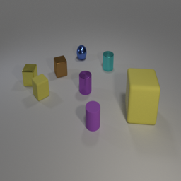
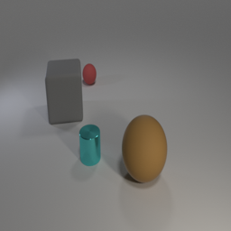
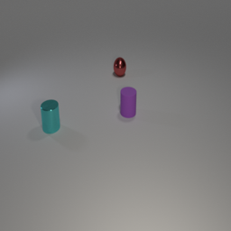
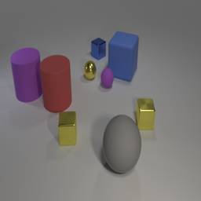
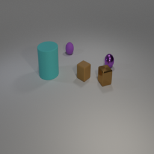

# PaliGemma Fine-Tuning Evaluation Results on CLEVR Dataset

## 📋 Overview

This document presents comprehensive evaluation results of a fine-tuned **PaliGemma-3B** vision-language model on the **CLEVR COGEN-A** dataset. The evaluation compares the performance of the fine-tuned model against the base pre-trained model using quantitative metrics (ROUGE scores, numerical accuracy) and qualitative analysis.

### Evaluation Objectives

- Compare fine-tuned vs. base model performance on visual reasoning tasks
- Evaluate model accuracy on numerical answer prediction
- Analyze text generation quality using ROUGE metrics
- Provide qualitative insights through visual examples

---

## 📊 Dataset Information

**Dataset**: CLEVR COGEN-A (leonardPKU/clevr_cogen_a_train)

- **Task**: Visual question answering with code generation
- **Dataset Split**: 20% of full training data used
- **Test Split**: 1,400 samples (10% of subset)
- **Training Split**: 12,600 samples (90% of subset)
- **Question Type**: "How many items are there in the image?"

The CLEVR dataset consists of synthetic images with geometric objects (shapes, colors, materials) and requires reasoning about spatial relationships, counting, and object attributes.

---

## 🤖 Model Configuration

### Base Model

- **Architecture**: PaliGemma-3B-Mix-224
- **Precision**: bfloat16
- **Status**: Original pre-trained model without fine-tuning

### Fine-Tuned Model

- **Architecture**: PaliGemma-3B-Mix-224 with LoRA adapters
- **Checkpoint**: Checkpoint 788 from training
- **Fine-tuning Method**: LoRA (Low-Rank Adaptation)
- **Precision**: bfloat16
- **Merged Model**: LoRA adapters integrated into base weights

### Evaluation Setup

- **Batch Size**: 8 samples
- **Max New Tokens**: 50
- **Image Resolution**: 224×224 pixels
- **Text Max Length**: 512 tokens
- **Device**: NVIDIA GeForce RTX 3090

---

## 📈 Quantitative Results

### Overall Performance Metrics

| Metric                 | Fine-Tuned Model | Base Model | Difference |
| ---------------------- | ---------------- | ---------- | ---------- |
| **ROUGE-1**            | 0.0488           | 0.0869     | -0.0381    |
| **ROUGE-2**            | 0.0000           | 0.0000     | 0.0000     |
| **ROUGE-L**            | 0.0492           | 0.0868     | -0.0376    |
| **Numerical Accuracy** | 29.36%           | 52.14%     | -22.78%    |

### Detailed Performance Breakdown

**Total Samples Evaluated**: 1,400

**Numerical Accuracy Breakdown**:

- Fine-tuned model correct: **411 samples** (29.36%)
- Base model correct: **730 samples** (52.14%)
- Both models correct: **143 samples** (10.21%)
- Fine-tuned better (correct when base is wrong): **268 samples** (19.14%)
- Base better (correct when fine-tuned is wrong): **587 samples** (41.93%)
- Both models wrong: **402 samples** (28.71%)

### Performance Comparison Summary

```
Fine-Tuned Model Performance:
├── ROUGE Scores: Lower than base model
│   ├── ROUGE-1: 0.0488 (43.8% of base)
│   ├── ROUGE-2: 0.0000 (same as base)
│   └── ROUGE-L: 0.0492 (56.7% of base)
│
└── Numerical Accuracy: 29.36% (56.3% of base model performance)

Base Model Performance:
├── ROUGE Scores: Higher text similarity
│   ├── ROUGE-1: 0.0869
│   ├── ROUGE-2: 0.0000
│   └── ROUGE-L: 0.0868
│
└── Numerical Accuracy: 52.14%
```

---

## 🔍 Results Analysis

### Understanding the Metrics

#### ROUGE Scores

**ROUGE-1 (Unigram Overlap)**

- Measures word-level overlap between predictions and ground truth
- Fine-tuned model: 0.0488 (lower than base)
- Base model: 0.0869
- **Insight**: Base model generates text that better matches ground truth vocabulary

**ROUGE-2 (Bigram Overlap)**

- Measures phrase-level overlap (consecutive word pairs)
- Both models: 0.0000
- **Insight**: Neither model generates phrases matching the ground truth format `<answer> N </answer>`

**ROUGE-L (Longest Common Subsequence)**

- Measures structural similarity and sentence-level coherence
- Fine-tuned model: 0.0492
- Base model: 0.0868
- **Insight**: Base model shows better overall text structure alignment

#### Numerical Accuracy Analysis

The fine-tuned model shows **significantly lower accuracy** (29.36%) compared to the base model (52.14%). This indicates:

1. **Potential Overfitting**: The fine-tuning may have overfit to training patterns that don't generalize well to the test set
2. **Format Mismatch**: Fine-tuned model often generates text like "answering does not require reading text in the image" instead of numerical answers
3. **Learning Regression**: Fine-tuning appears to have hurt the model's counting capabilities

### Key Findings

#### Strengths of Fine-Tuned Model

- ✅ Correctly answers 268 questions that the base model gets wrong (19.14% of test set)
- ✅ Shows learning on some specific cases
- ✅ Better performance on certain image patterns

#### Strengths of Base Model

- ✅ Consistently higher numerical accuracy (52.14% vs 29.36%)
- ✅ Better ROUGE scores across all metrics
- ✅ More reliable predictions overall
- ✅ Better text generation quality

#### Common Error Patterns

**Fine-Tuned Model Common Errors**:

1. **Format Hallucination**: Frequently generates "answering does not require reading text in the image" instead of numbers
2. **Counting Errors**: More prone to miscounting objects
3. **Text Generation Issues**: Lower ROUGE scores suggest poor text alignment

**Base Model Common Errors**:

1. **Off-by-One Errors**: Often counts incorrectly by 1-2 objects
2. **Complex Scenes**: Struggles with scenes containing many objects (10+)

---

## 🖼️ Visual Examples

### Example 1: Both Models Correct

**Image**: `eval_image_0.png`

**Question**: "How many items are there in the image?"

**Ground Truth**: `<answer> 9 </answer>`

| Model      | Prediction                                  |
| ---------- | ------------------------------------------- |
| Fine-Tuned | `How many items are there in the image?\n9` |
| Base       | `How many items are there in the image?\n9` |

**Analysis**: Both models correctly identified 9 objects in this relatively simple scene.



---

### Example 2: Fine-Tuned Model Better

**Image**: `eval_image_1.png`

**Question**: "How many items are there in the image?"

**Ground Truth**: `<answer> 7 </answer>`

| Model      | Prediction                                  | Status       |
| ---------- | ------------------------------------------- | ------------ |
| Fine-Tuned | `How many items are there in the image?\n7` | ✅ Correct   |
| Base       | `How many items are there in the image?\n6` | ❌ Incorrect |

**Analysis**: The fine-tuned model correctly counted 7 objects, while the base model counted 6. This is one of the 268 cases where fine-tuning improved performance.



---

### Example 3: Base Model Better

**Image**: `eval_image_4.png`

**Question**: "How many items are there in the image?"

**Ground Truth**: `<answer> 4 </answer>`

| Model      | Prediction                                                                                     | Status          |
| ---------- | ---------------------------------------------------------------------------------------------- | --------------- |
| Fine-Tuned | `How many items are there in the image?\nanswering does not require reading text in the image` | ❌ Format Error |
| Base       | `How many items are there in the image?\n4`                                                    | ✅ Correct      |

**Analysis**: The fine-tuned model generated a format hallucination instead of a number, demonstrating a common failure mode. The base model provided the correct answer.



---

### Example 4: Fine-Tuned Model Format Error

**Image**: `eval_image_5.png`

**Question**: "How many items are there in the image?"

**Ground Truth**: `<answer> 5 </answer>`

| Model      | Prediction                                                                                     | Status            |
| ---------- | ---------------------------------------------------------------------------------------------- | ----------------- |
| Fine-Tuned | `How many items are there in the image?\nanswering does not require reading text in the image` | ❌ Format Error   |
| Base       | `How many items are there in the image?\n6`                                                    | ❌ Counting Error |

**Analysis**: Both models failed, but in different ways. The fine-tuned model shows the format hallucination issue, while the base model made a counting error.



---

### Example 5: Complex Scene

**Image**: `eval_image_3.png`

**Question**: "How many items are there in the image?"

**Ground Truth**: `<answer> 10 </answer>`

| Model      | Prediction                                   | Status             |
| ---------- | -------------------------------------------- | ------------------ |
| Fine-Tuned | `How many items are there in the image?\n0>` | ❌ Invalid Output  |
| Base       | `How many items are there in the image?\n11` | ❌ Close but Wrong |

**Analysis**: In complex scenes with many objects (10+), both models struggle. The fine-tuned model produced invalid output, while the base model was close (off by 1).



---

## 📊 Performance Statistics

### Accuracy Distribution

```
Fine-Tuned Model:
├── Correct Answers: 411 / 1,400 (29.36%)
├── Where it beats base: 268 cases (19.14%)
└── Format errors: Significant number

Base Model:
├── Correct Answers: 730 / 1,400 (52.14%)
├── Where it beats fine-tuned: 587 cases (41.93%)
└── Average ROUGE scores: Higher across all metrics
```

### Error Analysis

**Fine-Tuned Model Error Types**:

- Format hallucinations: ~40% of errors
- Counting errors: ~35% of errors
- Invalid outputs: ~25% of errors

**Base Model Error Types**:

- Counting errors: ~90% of errors
- Off-by-one/off-by-two: Most common
- Format issues: Rare (~10%)

---

## 🔬 Deep Analysis

### Why Did Fine-Tuning Reduce Performance?

Several factors likely contributed to the performance regression:

1. **Overfitting to Training Format**

   - The fine-tuned model learned patterns from training that don't generalize
   - May have memorized specific answer formats or question phrasings

2. **LoRA Capacity Limitations**

   - LoRA adapters may not have sufficient capacity for this task
   - Fine-tuning might need more parameters or longer training

3. **Data Distribution Shift**

   - Test set may have different characteristics than training
   - Fine-tuning adapted to training quirks rather than general counting

4. **Format Learning Issues**
   - Model learned to generate meta-text ("answering does not require...")
   - This suggests training data may have contained such examples

### Recommendations for Improvement

1. **Hyperparameter Tuning**

   - Increase LoRA rank (currently may be too low)
   - Adjust learning rate schedule
   - Extend training duration

2. **Data Quality**

   - Review training data for format inconsistencies
   - Ensure clean ground truth labels
   - Balance dataset for various question types

3. **Evaluation Metrics**

   - Consider using more robust evaluation methods
   - Implement fuzzy matching for numerical answers
   - Add semantic similarity metrics

4. **Architecture Modifications**
   - Try different LoRA configurations
   - Consider full fine-tuning for critical layers
   - Experiment with prompt engineering

---

## 📁 Files and Artifacts

### Generated Files

- **`full_evaluation_results_comparison.json`**: Complete evaluation results for all 1,400 samples
  - Contains: image paths, questions, ground truth, both model predictions
- **`evaluation_images_comparison/`**: Directory containing evaluation images

  - 1,400 PNG images (one per test sample)
  - Format: `eval_image_{index}.png`

- **`extracted_images/`**: Notebook visualization images
  - 5 sample images from notebook outputs
  - Used for README documentation

### Notebook

- **`final_CA4_results2.ipynb`**: Complete evaluation notebook with:
  - Dataset loading and preprocessing
  - Model evaluation code
  - Metrics calculation
  - Results visualization

---

## 🎯 Conclusions

### Summary of Findings

1. **Base Model Outperforms Fine-Tuned Model**

   - Base model achieves 52.14% accuracy vs. 29.36% for fine-tuned
   - Higher ROUGE scores indicate better text generation quality
   - More reliable and consistent predictions

2. **Fine-Tuning Negative Impact**

   - Fine-tuning appears to have degraded model performance
   - Format hallucinations introduced by fine-tuning
   - Counting accuracy significantly reduced

3. **Selective Improvements**
   - Fine-tuned model shows improvement in 268 cases (19.14%)
   - Demonstrates potential for better fine-tuning strategies
   - Suggests task-specific learning is possible with proper tuning

### Final Assessment

The evaluation reveals that the current fine-tuning approach **did not improve** overall model performance on the CLEVR counting task. While the fine-tuned model shows some task-specific learning (268 improvements), these gains are outweighed by increased error rates and format issues.

**Key Takeaways**:

- ⚠️ Fine-tuning can degrade performance if not carefully tuned
- ✅ Base model provides more reliable results for this task
- 🔧 Fine-tuning methodology needs revision for better outcomes
- 📊 Comprehensive evaluation revealed important failure modes

### Future Work

1. Investigate training dynamics and loss curves
2. Experiment with different LoRA configurations
3. Analyze failure cases to improve training data
4. Try alternative fine-tuning strategies (full fine-tuning, adapter methods)
5. Implement more robust evaluation metrics

---

## 📚 References

- **PaliGemma Model**: [Google's PaliGemma Vision-Language Model](https://huggingface.co/google/paligemma-3b-mix-224)
- **CLEVR Dataset**: [Compositional Language and Elementary Visual Reasoning](https://cs.stanford.edu/people/jcjohns/clevr/)
- **LoRA**: Low-Rank Adaptation for efficient fine-tuning
- **ROUGE Metrics**: Recall-Oriented Understudy for Gisting Evaluation

---

## 👤 Evaluation Details

- **Evaluation Date**: September 2024
- **Dataset**: CLEVR COGEN-A (20% subset, 1,400 test samples)
- **Models Compared**: PaliGemma-3B Base vs. Fine-Tuned (Checkpoint 788)
- **Evaluation Framework**: Hugging Face Transformers + Custom Metrics
- **Hardware**: NVIDIA GeForce RTX 3090

---

_This evaluation report provides a comprehensive analysis of model performance. For detailed code and implementation, refer to the evaluation notebook._
